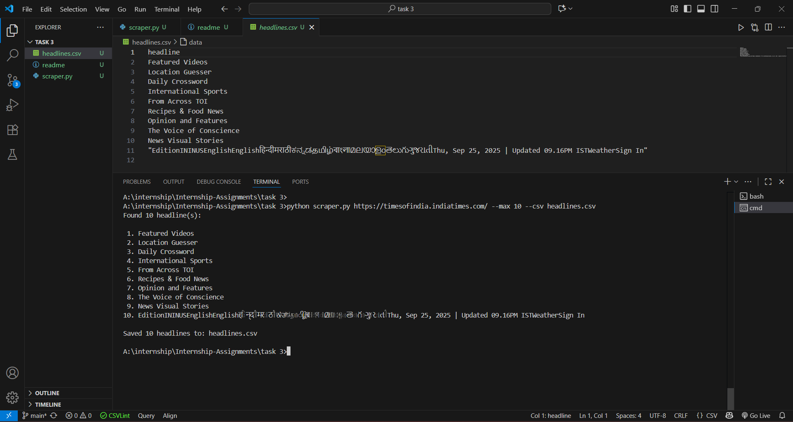

# Task 3 – News Headlines Web Scraper

A simple Python script to collect **news headlines** from any news website.  
It fetches the HTML page using `requests`, parses it with `BeautifulSoup`, and extracts headlines.  
Results are displayed in the terminal and can be saved to a CSV file.

---

##  Project Files

- `scraper.py` – Main Python script  
- `requirements.txt` – Required libraries  
- `README.md` – Documentation  
- `headlines.csv` – (Optional) Example output  

---

## How to Run the Script

Run the scraper by providing a valid news website URL:

```bash
python scraper.py <URL>
```

**Example:**
```bash
python scraper.py https://timesofindia.indiatimes.com/ --max 10 --csv headlines.csv
```

**Options:**
- `<URL>` – Website URL to scrape (e.g., https://www.bbc.com/news)
- `--max` – Maximum number of headlines to fetch (default: 20)
- `--csv <filename>` – Save results to a CSV file (optional)

---

##  Example Output

**In the Terminal:**
```
Found 5 headline(s):

 1. Major earthquake strikes Asia
 2. New AI technology changing healthcare
 3. Stock markets rise after policy changes
 4. Climate summit calls for urgent action
 5. Space mission successfully launches
```

**In headlines.csv:**
```
headline
Major earthquake strikes Asia
New AI technology changing healthcare
Stock markets rise after policy changes
Climate summit calls for urgent action
Space mission successfully launches
```
*(Your output will vary depending on the news site and current headlines.)*

---

##  Key Concepts Learned

**Q9. What is a try-except block?**  
A try-except block in Python is used to handle errors gracefully.  
Instead of crashing, the program catches the error and handles it.

*Example:*
```python
try:
	 x = 10 / 0
except ZeroDivisionError:
	 print("You cannot divide by zero!")
```

**Q10. What are HTTP status codes?**  
HTTP status codes are 3-digit responses from a server when you request a webpage:
- 200 – Success (OK)
- 301 – Redirect (page moved)
- 404 – Not Found (page doesn’t exist)
- 500 – Internal Server Error (server problem)

### Sample Output Screenshot




